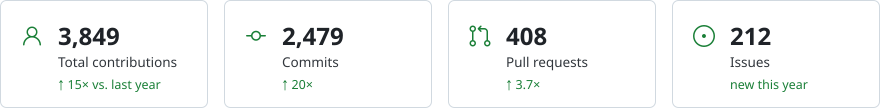
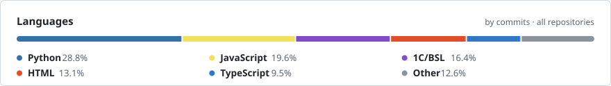
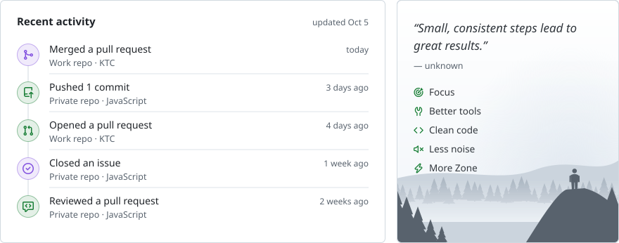

<picture>
  <source media="(prefers-color-scheme: dark)" srcset="assets/hero.dark.svg">
   keep building_ — exploring systems, automation and developer tools" src="assets/hero.light.svg" width="880">
</picture>

<picture>
  <source media="(prefers-color-scheme: dark)" srcset="assets/stats.dark.svg">
  
</picture>

<picture>
  <source media="(prefers-color-scheme: dark)" srcset="assets/languages.dark.svg">
  
</picture>

<picture>
  <source media="(prefers-color-scheme: dark)" srcset="assets/activity.dark.svg">
  
</picture>

<!--
  Dashboard cards, auto-generated daily by .github/workflows/profile-stats.yml
  → scripts/build_stats.py reads live GitHub data and renders assets/*.svg.
  → Copy (intro, facts, quote) lives in scripts/profile.json.
  → Company repo + org labels come from the PROFILE_PRIVATE secret; private repo names never reach the SVGs.
  Adapts to the viewer's GitHub theme via <picture> + prefers-color-scheme.
-->
